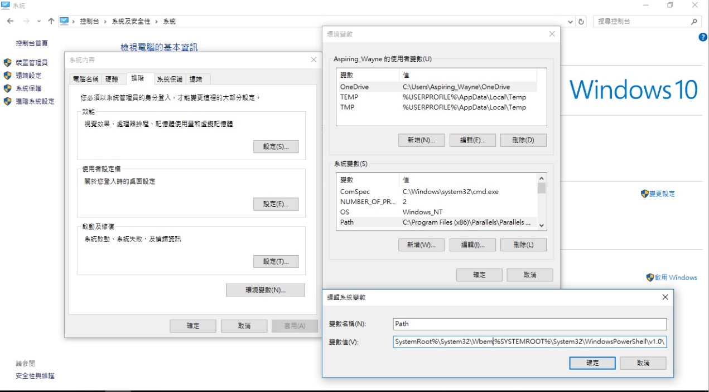
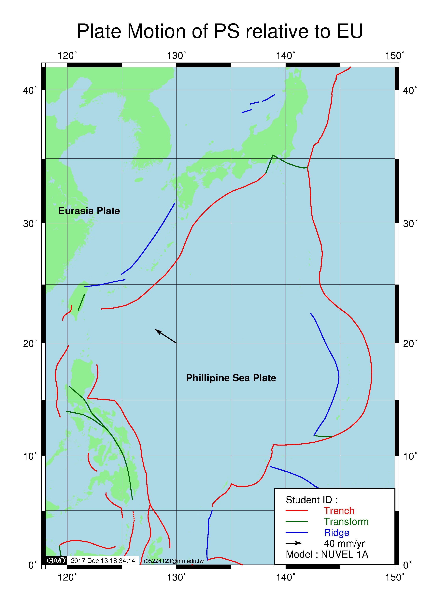
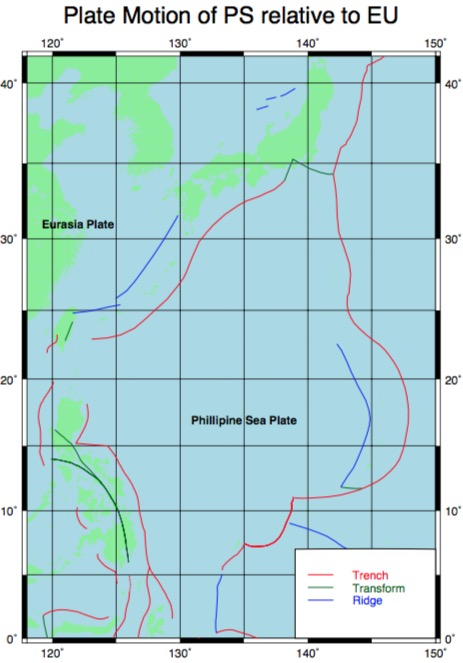

# Earth Structure 2017 HW13 - GMT Tutorial for Plate Motion

## 目的：教同學如何使用 GMT 完成板塊運動地圖。
影片教學可以參考 [>這邊<](https://youtu.be/Q5tekS73iSA)
***

板塊運動模型計算機：  
1. [連結1](https://www.unavco.org/software/geodetic-utilities/plate-motion-calculator/plate-motion-calculator.html)  ：可直接批次計算，並直接輸出 psvelo 格式的檔案。  
2. [連結2](http://ofgs.aori.u-tokyo.ac.jp/~okino/platecalc_new.html)

***

## 軟體安裝
請至 [GMT 官網](http://gmt.soest.hawaii.edu/projects/gmt/wiki/Download)下載對應平台的安裝程式。
### Mac

可以見專案中的「**Install_GMT_5.3.1_on_Mac_zhTW .pdf**」檔案。

#### 官方下載 DMG 檔

1. 將 DMG 檔下載後掛載。
2. 將 GMT-X.X.X.app 拖入 Application 資料夾中。
3. 顯示 GMT的執行檔路徑：  
執行「GMT-5.2.1.app」，輸入：```echo ${PATH%%:*}```，將其輸出的路徑複製起來（如：```/Applications/GMT-5.2.1.app/Contents/Resources/bin```）
4. 將"gmt"指令加入系統的搜尋路徑中：
	1. 打開「Terminal.app」，進入使用者家目錄下：  
	```cd ~/```  
	2. 以喜好的文字編輯器打開「.bash_profile」，如：  
	```nano .bash_profile```   
	3. 在檔案的最後加入：```#Add GMT to Terminal search path on 20171213
export PATH="/Applications/GMT-5.2.1.app/Contents/Resources/bin:${PATH}```  
	4. 存檔：按```control + O``` -> ```Return``` -> ```control + X```。  
	5. 套用檔案設定：```source ~/.bash_profile```  

#### 使用 Homebrew 套件管理軟體

1. 至 [Homebrew 官網](https://brew.sh/index_zh-tw.html) 觀看說明。（開啟 Terminal.app ，鍵入下面的程式碼：
``` /usr/bin/ruby -e "$(curl -fsSL https://raw.githubusercontent.com/Homebrew/install/master/install)" ```）  
2. 鍵入下面程式碼：``` brew tap homebrew/science```，將 GMT 的菜單加入。
3. 鍵入下面程式碼：``` brew install gmt```，並依照指示安裝。

### Windows

#### Ghostscript

* 至 [Ghostscript 官網](https://www.ghostscript.com/download/gsdnld.html)下載Ghostscript並安裝之。

#### GSView

* 至 [官方網站](http://pages.cs.wisc.edu/~ghost/gsview/get50.htm)（GSView 5.0）或[官方網站](http://www.gsview.com/)（GSView 6.0）下載並安裝的執行檔。

#### Notepad++ （文字編輯器）

* 至 [官方網站](https://notepad-plus-plus.org/zh/)下載並安裝之。

#### GMT

* 至 [GMT 官網](http://gmt.soest.hawaii.edu/projects/gmt/wiki/Download)下載執行檔並安裝。 **注意：請安裝「完整功能」包含 DCW、GSHHG**  
* 將安裝路徑記下。
* 將 GMT bin 資料夾加入系統搜尋路徑：
	* **「控制台 > 系統及安全性 > 系統」**
	* 左方點選**「進階系統設定」**
	* **「系統內容」**視窗下，**「進階」**標籤下，按下**「環境變數」**  
	* **「環境變數」**視窗中，找到中下方**「系統變數」**，找到**「Path」**的變數，點兩下，或按下「編輯」。
		* （傳統）在最後方加入「**;**」以及 GMT 安裝路徑。
		* （新）按下**「新增」**	，並加入 GMT 安裝路徑。
示意圖如下：


***

## 作業說明

### 目標

將板塊移動模型所計算出的向量場繪製在地圖上。
下面是範例檔：


### 說明：

助教已經將底圖(**PlateMotionTemp.ps**)繪製完成，同學只需要將向量加上即可。
底圖示意圖如下：


### 教學：

#### Mac/Linux

* 請用文字編輯器開啟「**PlateMotionHomework.sh**」
* 首先設定一些個人資訊：  
	* ```save=PlateMotion1.ps```：指定輸出的檔名。
	* ```StudentID=r05224123```：指定自己的學號。  
	* ```Model="NUVEL 1A"```：指定計算使用的模型為何。
* 在第21行的地方貼入你計算得到的板塊移動速度：   
```Lon(°E) Lat(°N) Evel(mm/yr) Nvel(mm/yr) Eerr Nerr corr Plate(Reference) Model Site```  
```130.000000  20.000000  -53.55   34.54 0 0 0 PH(EU) NUVEL 1A Ex1```
注意：此段程式碼會跳過第一行的資料，因此第一行請放標題。
* 儲存檔案，使用**Terminal.app**執行：
	* 開啟**Terminal.app**。
	* 進入本專案資料夾：```cd ${把資料夾拖進來}```，```${把資料夾拖進來}```這邊把資料夾拖進終端機視窗中，按下```return```。
	* 鍵入下面程式碼執行：```sh PlateMotionHomework.sh```，按下```return```。
* 重複上述步驟，將不同的模型得到的資料繪出。

#### Windows

* 請用文字編輯器開啟「**PlateMotionHomework.bat**」
* 首先設定一些個人資訊：請將粗斜體的部分代換為自己的資訊。
	* set save=***PlateMotion1.ps***&REM 設定存檔的檔名
	* set InputVector=***Vector.txt***&REM 設定讀入的向量檔
	* set StudentID=***r05224123*** &REM 設定自己的學號
	* set Model=***"NUVEL 1A"*** &REM 設定模型的名稱
* 接著，將板塊移動的向量儲存為***Vector.txt***。格式如下：  
```Lon(°E) Lat(°N) Evel(mm/yr) Nvel(mm/yr) Eerr Nerr corr Plate(Reference) Model Site```  
```130.000000  20.000000  -53.55   34.54 0 0 0 PH(EU) NUVEL 1A Ex1```
* 儲存檔案。  
* 使用**CMD.exe**（命令提示字元）執行：
	* 開啟命令提示字元。
	* 進入本專案資料夾：```cd ${把資料夾拖進來}```，```${把資料夾拖進來}```這邊把資料夾拖進終端機視窗中，按下```enter```。
	* 鍵入下面程式碼執行：```PlateMotionHomework.bat```，按下```enter ```。
* 重複上述步驟，將不同的模型得到的資料繪出。

### 註記

PSVELO 向量檔格式可參考***Vector.txt***中的樣式，可多行。

### 作者

臺大地質所 碩一 孫正瑋  
地球構造課程助教 2017  
聯絡方式： r05224123[at]ntu.edu.tw  
  
想瞭解更多 GMT 相關知識，歡迎修習「地球科學繪圖」課程。
